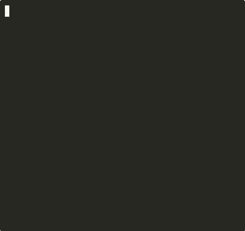
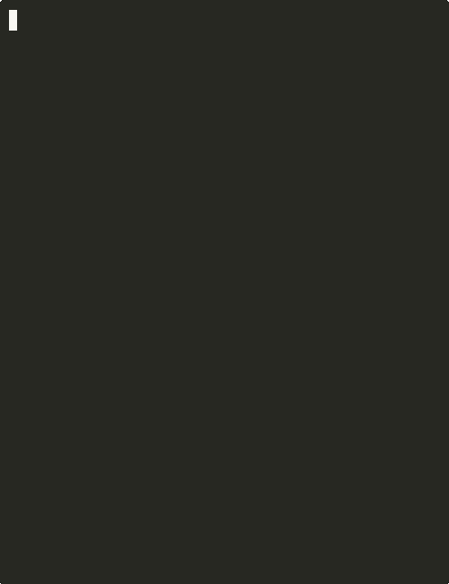
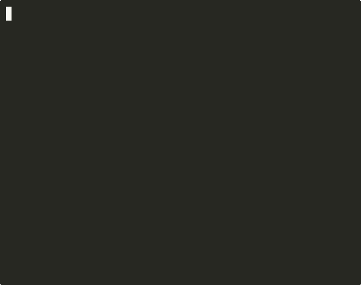

# Kettle

A Racket library for building Terminal User Interfaces (TUIs). Ported from the Common Lisp `cl-tuition` library.

Kettle follows the **model-update-view** pattern (inspired by Elm/Haskell Brick): define your state, how it updates in response to messages, and how it renders -- Kettle handles the terminal, event loop, and rendering.

## Examples

### Counter

A minimal program showing the model-update-view pattern. The entire model is a single number.

```bash
racket kettle-examples/kettle/examples/counter.rkt
```


### Stopwatch

ASCII-art stopwatch with lap recording, styled rendering, and tick-based subscriptions.

```bash
racket kettle-examples/kettle/examples/stopwatch.rkt
```



### Todo List

Component composition with text input and list view. Shows mode switching and delegated updates.

```bash
racket kettle-examples/kettle/examples/todo.rkt
```


### Snake

Classic snake game with collision detection, score tracking, and timer subscriptions.

```bash
racket kettle-examples/kettle/examples/snake.rkt
```



### Text Viewer

Scrollable file viewer using the viewport component with styled borders.

```bash
racket kettle-examples/kettle/examples/viewer.rkt README.md
```



### Process Viewer

A `top`/`htop`-style process viewer with real-time updates, sortable columns, CPU/memory bars, and mouse support.

```bash
racket kettle-examples/kettle/examples/top.rkt
```


## Getting Started

```racket
#lang racket/base
(require kettle/run kettle/image kettle/program)

(define (on-key count msg)
  (match msg
    [(key-msg #\q _ _) (cmd count (quit-cmd))]
    [(key-msg #\+ _ _) (add1 count)]
    [_ count]))

(define (to-view count)
  (vcat 'left
    (format "Count: ~a" count)
    "  + increment  q quit"))

(run 0 #:on-key on-key #:to-view to-view)
```

## Installation

```bash
raco pkg install --auto ./kettle-lib ./kettle-components ./kettle-test-lib ./kettle-doc ./kettle
```

To also install examples and tests:

```bash
raco pkg install --auto ./kettle-examples ./kettle-test
```

## Package Structure

- **kettle/** -- Meta package (depends on kettle-lib and kettle-doc)
- **kettle-lib/** -- Core implementation: event loop, rendering, image tree, components
- **kettle-doc/** -- Scribble documentation
- **kettle-components/** -- Additional components (datepicker, markdown, overlay, zone-manager)
- **kettle-examples/** -- Example programs (33 demos)
- **kettle-test-lib/** -- Test support: headless harness (`kettle/test`) and tmux e2e harness (`kettle/test-tmux`)
- **kettle-test/** -- Unit, integration, e2e, and benchmark tests

## Key Modules

| Module | Description |
|--------|-------------|
| `kettle` | Re-exports the full API |
| `kettle/run` | Big-bang-style entry point |
| `kettle/program` | Event loop, `define-kettle-program`, messages |
| `kettle/image` | Algebraic image tree (text, hcat, vcat, zcat, styled, flex, crop, pad) |
| `kettle/style` | ANSI styling, colors (16/256/truecolor) |
| `kettle/border` | Box border rendering |
| `kettle/layout` | String-based horizontal/vertical joining |

### Components (kettle-lib)

| Module | Description |
|--------|-------------|
| `kettle/components/textinput` | Single-line text input |
| `kettle/components/textarea` | Multi-line text area |
| `kettle/components/list-view` | Navigable list with selection |
| `kettle/components/table` | Table display with headers |
| `kettle/components/viewport` | Scrollable viewport |
| `kettle/components/spinner` | Loading spinner animation |
| `kettle/components/progress` | Progress bar |
| `kettle/components/paginator` | Page navigation |

### Additional Components (kettle-components)

| Module | Description |
|--------|-------------|
| `kettle/components/datepicker` | Date picker |
| `kettle/components/markdown` | Markdown rendering |
| `kettle/components/overlay` | Overlay/modal support |
| `kettle/components/zone-manager` | Focus zone management |

### Test Support (kettle-test-lib)

| Module | Description |
|--------|-------------|
| `kettle/test` | Headless, synchronous test harness for Kettle programs |
| `kettle/test-tmux` | tmux-based end-to-end test harness with screen capture |

## Testing

```bash
# Run all tests
raco test -y kettle-test/kettle/tests/

# Run e2e tests only (requires tmux)
raco test -y kettle-test/kettle/tests/test-e2e.rkt

# Run benchmarks with full output
racket -y kettle-test/kettle/tests/bench-ansi-text.rkt
racket -y kettle-test/kettle/tests/bench-render.rkt
racket -y kettle-test/kettle/tests/bench-log-viewer.rkt
```

## Recording GIFs

The `record-gif.sh` tool records scripted interactions with a Kettle program as animated GIFs, using asciinema and [agg](https://github.com/asciinema/agg).

```bash
# Record a program with a script
kettle-examples/kettle/examples/record-gif.sh <script-file> <output.gif> [options]
```

See `record-gif.sh --help` and the `.script` files in `kettle-examples/kettle/examples/recordings/` for the scripting format.

## License

MIT
